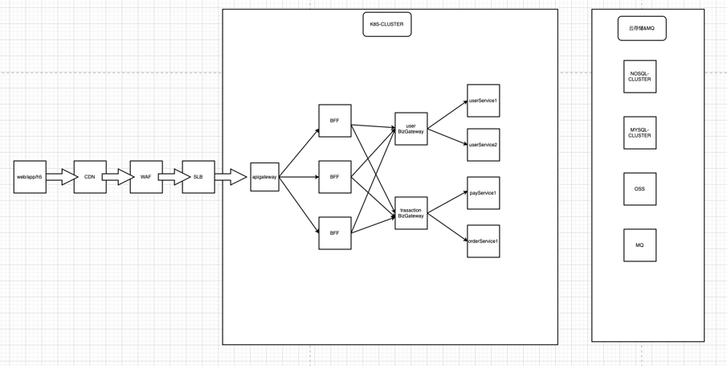

#名词解释
##1.bff: 服务于前端的后端，是一个服务聚合层
### 聚合种类 1、聚合领域内的各个微服务，提供裁剪和统一出口
### 聚合种类 2、还聚合了其他第三方的服务
### 访问控制、应用缓存、第三方交互（展示性，非分布式事务，分布式事务要放到 application 层里面）
## 聚合层和业务（领域）网关的区别
###1、BFF 下面还有一层 BIZ-GATEWAY 聚合下面的架构域的服务
###2、BFF 直接连接后端各个微服务
###3、如果是大型公司则后面基本有 BIZ-GATEWAY（架构域下的微服务基本不动，而是上面的领导人动）
###4、如果是中小型公司，则可以直接连后面各个微服务（组织架构变更，微服务好转移到别的团队）

## 参考 https://www.jianshu.com/p/eb1875c62ad3
## 参考 https://blog.csdn.net/qq_35789269/article/details/109709584
## 阿里云高可用架构
### https://developer.aliyun.com/article/608154
### https://blog.csdn.net/zhangjunli/article/details/106196808

