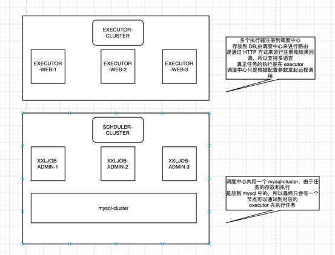

#遵循一个基本原则，调用领域服务不要自己连接数据库，而要通过领域服务的 api 去调用
##数据清洗两种方式
    1、大数据里面写 jar 包 提交到 azkaban，批处理执行
    2、清理自己的数据库（mysql)
        批量查询
        批量修改
        批量更新
        要遵循： 
                1、采用批量更新语句，减少和数据库交互的次数
                2、如果可以并行，那么可以可以启动 5 个线程去批量更新（不推荐）
                3、还是一个批次更新 10W 条，直接循环处理，不要给数据库太大压力
## xxljob 分片方式
        单机多任务 或者 多机多任务
            https://blog.csdn.net/it_freshman/article/details/105421781

## xxljob 对宕机超时的处理
        https://juejin.cn/post/6844903954145361927
        https://www.cnblogs.com/guoyinli/p/11555035.html

### mysql 批量插入优化
    10W级别 4S
    100W 级别 40S
    1000W  5-20MIN
    https://blog.csdn.net/zdw19861127/article/details/78597523?utm_term=mysql%E4%B8%80%E4%BA%8B%E5%8A%A1%E4%B8%AD%E7%9A%84%E6%89%B9%E9%87%8F%E6%93%8D%E4%BD%9C&utm_medium=distribute.pc_aggpage_search_result.none-task-blog-2~all~sobaiduweb~default-1-78597523&spm=3001.4430
    https://blog.csdn.net/u011277123/article/details/61914773?utm_medium=distribute.pc_relevant.none-task-blog-BlogCommendFromMachineLearnPai2-1.control&depth_1-utm_source=distribute.pc_relevant.none-task-blog-BlogCommendFromMachineLearnPai2-1.control
##HA
5.11 故障转移 & 失败重试
一次完整任务流程包括”调度（调度中心） + 执行（执行器）”两个阶段。

“故障转移”发生在调度阶段，在执行器集群部署时，如果某一台执行器发生故障，该策略支持自动进行Failover切换到一台正常的执行器机器并且完成调度请求流程。
“失败重试”发生在”调度 + 执行”两个阶段，支持通过自定义任务失败重试次数，当任务失败时将会按照预设的失败重试次数主动进行重试；

    5.20 避免任务重复执行
调度密集或者耗时任务可能会导致任务阻塞，集群情况下调度组件小概率情况下会重复触发；
针对上述情况，可以通过结合 “单机路由策略（如：第一台、一致性哈希）” + “阻塞策略（如：单机串行、丢弃后续调度）” 来规避，最终避免任务重复执行。

5.23 调度结果丢失处理

执行器因网络抖动回调失败或宕机等异常情况，会导致任务调度结果丢失。由于调度中心依赖执行器回调来感知调度结果，因此会导致调度日志永远处于 “运行中” 状态。

针对该问题，调度中心提供内置组件进行处理，逻辑为：调度记录停留在 “运行中” 状态超过10min，且对应执行器心跳注册失败不在线，则将本地调度主动标记失败；

5.4.2 自研调度模块
XXL-JOB最终选择自研调度组件（早期调度组件基于Quartz）；一方面是为了精简系统降低冗余依赖，另一方面是为了提供系统的可控度与稳定性；

XXL-JOB中“调度模块”和“任务模块”完全解耦，调度模块进行任务调度时，将会解析不同的任务参数发起远程调用，调用各自的远程执行器服务。这种调用模型类似RPC调用，调度中心提供调用代理的功能，而执行器提供远程服务的功能。

5.4.3 调度中心HA（集群）
基于数据库的集群方案，数据库选用Mysql；集群分布式并发环境中进行定时任务调度时，会在各个节点会上报任务，存到数据库中，执行时会从数据库中取出触发器来执行，如果触发器的名称和执行时间相同，则只有一个节点去执行此任务。

步骤五：执行器集群（可选）：
执行器支持集群部署，提升调度系统可用性，同时提升任务处理能力。

执行器集群部署时，几点要求和建议：

执行器回调地址（xxl.job.admin.addresses）需要保持一致；执行器根据该配置进行执行器自动注册等操作。
同一个执行器集群内AppName（xxl.job.executor.appname）需要保持一致；调度中心根据该配置动态发现不同集群的在线执行器列表。

